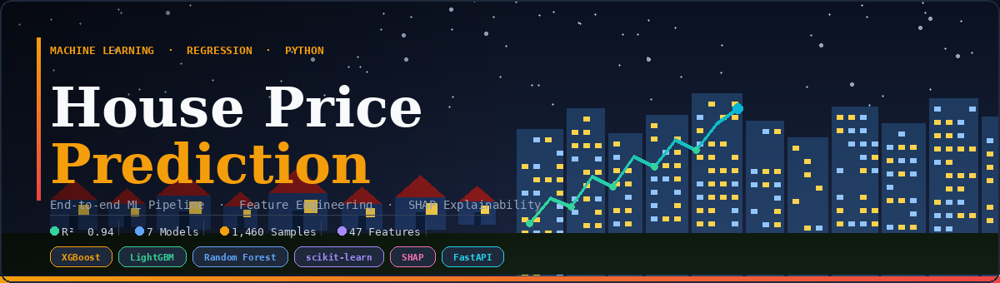

[README.md](https://github.com/user-attachments/files/27117218/README.md)
<div align="center">

<svg width="900" height="260" viewBox="0 0 900 260" xmlns="http://www.w3.org/2000/svg">
  <defs>
    <linearGradient id="bg" x1="0" y1="0" x2="1" y2="1">
      <stop offset="0%" stop-color="#0B1120"/>
      <stop offset="100%" stop-color="#1A2540"/>
    </linearGradient>
    <linearGradient id="accent" x1="0" y1="0" x2="1" y2="0">
      <stop offset="0%" stop-color="#F59E0B"/>
      <stop offset="100%" stop-color="#EF4444"/>
    </linearGradient>
    <linearGradient id="trend" x1="0" y1="0" x2="1" y2="0">
      <stop offset="0%" stop-color="#34D399"/>
      <stop offset="100%" stop-color="#06B6D4"/>
    </linearGradient>
    <linearGradient id="bldA" x1="0" y1="0" x2="0" y2="1">
      <stop offset="0%" stop-color="#1E3A5F"/>
      <stop offset="100%" stop-color="#0F2040"/>
    </linearGradient>
    <linearGradient id="bldB" x1="0" y1="0" x2="0" y2="1">
      <stop offset="0%" stop-color="#243B55"/>
      <stop offset="100%" stop-color="#141E30"/>
    </linearGradient>
    <linearGradient id="houseG" x1="0" y1="0" x2="0" y2="1">
      <stop offset="0%" stop-color="#1C3461"/>
      <stop offset="100%" stop-color="#0D1F3C"/>
    </linearGradient>
    <clipPath id="clip"><rect width="900" height="260" rx="12"/></clipPath>
  </defs>
  <g clip-path="url(#clip)">
    <rect width="900" height="260" fill="url(#bg)"/>
    <!-- stars -->
    <circle cx="120" cy="30" r="1.2" fill="#94A3B8" opacity=".6"/>
    <circle cx="220" cy="18" r=".8" fill="#94A3B8" opacity=".4"/>
    <circle cx="340" cy="44" r="1.2" fill="#94A3B8" opacity=".5"/>
    <circle cx="460" cy="22" r=".9" fill="#94A3B8" opacity=".4"/>
    <circle cx="570" cy="38" r="1.5" fill="#94A3B8" opacity=".4"/>
    <circle cx="680" cy="16" r="1" fill="#94A3B8" opacity=".5"/>
    <circle cx="800" cy="28" r="1.2" fill="#94A3B8" opacity=".3"/>
    <circle cx="850" cy="50" r="1" fill="#94A3B8" opacity=".4"/>
    <!-- city skyline -->
    <rect x="510" y="112" width="48" height="120" fill="url(#bldA)"/>
    <rect x="562" y="90"  width="40" height="142" fill="url(#bldB)"/>
    <rect x="606" y="120" width="36" height="112" fill="url(#bldA)"/>
    <rect x="645" y="100" width="44" height="132" fill="url(#bldB)"/>
    <rect x="693" y="82"  width="52" height="150" fill="url(#bldA)"/>
    <rect x="749" y="110" width="38" height="122" fill="url(#bldB)"/>
    <rect x="791" y="130" width="42" height="102" fill="url(#bldA)"/>
    <rect x="836" y="104" width="46" height="128" fill="url(#bldB)"/>
    <!-- building windows -->
    <rect x="516" y="122" width="8" height="5" fill="#FCD34D" opacity=".6"/>
    <rect x="528" y="130" width="8" height="5" fill="#FCD34D" opacity=".4"/>
    <rect x="516" y="142" width="8" height="5" fill="#FCD34D" opacity=".7"/>
    <rect x="528" y="150" width="8" height="5" fill="#93C5FD" opacity=".5"/>
    <rect x="516" y="162" width="8" height="5" fill="#FCD34D" opacity=".5"/>
    <rect x="568" y="100" width="8" height="5" fill="#FCD34D" opacity=".7"/>
    <rect x="580" y="108" width="8" height="5" fill="#93C5FD" opacity=".4"/>
    <rect x="568" y="120" width="8" height="5" fill="#FCD34D" opacity=".6"/>
    <rect x="580" y="128" width="8" height="5" fill="#FCD34D" opacity=".3"/>
    <rect x="700" y="92"  width="10" height="6" fill="#FCD34D" opacity=".5"/>
    <rect x="716" y="92"  width="10" height="6" fill="#FCD34D" opacity=".3"/>
    <rect x="700" y="108" width="10" height="6" fill="#FCD34D" opacity=".7"/>
    <rect x="716" y="108" width="10" height="6" fill="#93C5FD" opacity=".5"/>
    <rect x="700" y="124" width="10" height="6" fill="#FCD34D" opacity=".4"/>
    <rect x="716" y="124" width="10" height="6" fill="#FCD34D" opacity=".6"/>
    <!-- ground -->
    <rect x="0" y="214" width="900" height="46" fill="#0E1A0E" opacity=".9"/>
    <!-- houses -->
    <polygon points="80,178 108,150 136,178"  fill="#8B1A1A"/>
    <rect x="85"  y="178" width="46" height="36" fill="url(#houseG)"/>
    <rect x="95"  y="190" width="11" height="24" fill="#0D1F3C"/>
    <rect x="112" y="190" width="12" height="12" fill="#FCD34D" opacity=".5"/>
    <polygon points="150,182 174,157 198,182" fill="#7A1515"/>
    <rect x="155" y="182" width="38" height="32" fill="url(#houseG)"/>
    <rect x="162" y="193" width="10" height="21" fill="#0D1F3C"/>
    <rect x="177" y="193" width="10" height="10" fill="#FCD34D" opacity=".4"/>
    <polygon points="210,176 242,145 274,176" fill="#8B1A1A"/>
    <rect x="215" y="176" width="54" height="38" fill="url(#houseG)"/>
    <rect x="225" y="188" width="12" height="26" fill="#0D1F3C"/>
    <rect x="244" y="188" width="14" height="14" fill="#FCD34D" opacity=".6"/>
    <polygon points="285,180 308,158 331,180" fill="#7A1515"/>
    <rect x="290" y="180" width="36" height="34" fill="url(#houseG)"/>
    <rect x="298" y="191" width="10" height="23" fill="#0D1F3C"/>
    <rect x="313" y="191" width="10" height="10" fill="#FCD34D" opacity=".35"/>
    <polygon points="345,174 380,140 415,174" fill="#8B1A1A"/>
    <rect x="350" y="174" width="60" height="40" fill="url(#houseG)"/>
    <rect x="362" y="186" width="13" height="28" fill="#0D1F3C"/>
    <rect x="381" y="186" width="15" height="15" fill="#FCD34D" opacity=".65"/>
    <polygon points="425,178 448,156 471,178" fill="#7A1515"/>
    <rect x="430" y="178" width="36" height="36" fill="url(#houseG)"/>
    <rect x="438" y="190" width="10" height="24" fill="#0D1F3C"/>
    <rect x="453" y="190" width="10" height="10" fill="#FCD34D" opacity=".4"/>
    <!-- left overlay for text -->
    <rect x="0" y="0" width="500" height="260" fill="#000" opacity=".2"/>
    <!-- accent bar -->
    <rect x="36" y="32" width="3" height="170" rx="1.5" fill="url(#accent)"/>
    <!-- badge -->
    <text x="50" y="58" font-family="'Courier New',monospace" font-size="10" font-weight="600" fill="#F59E0B" letter-spacing="2">ML · REGRESSION · PYTHON · XGBOOST</text>
    <!-- title -->
    <text x="50" y="108" font-family="Georgia,serif" font-size="46" font-weight="700" fill="#F8FAFC" letter-spacing="-1">House Price</text>
    <text x="50" y="152" font-family="Georgia,serif" font-size="46" font-weight="700" fill="#F59E0B" letter-spacing="-1">Prediction</text>
    <!-- subtitle -->
    <text x="50" y="176" font-family="'Courier New',monospace" font-size="12" fill="#94A3B8">End-to-end ML pipeline · Feature Engineering · SHAP Explainability</text>
    <!-- divider -->
    <line x1="50" y1="190" x2="480" y2="190" stroke="#334155" stroke-width=".5"/>
    <!-- metrics -->
    <circle cx="62"  cy="208" r="4" fill="#34D399" opacity=".9"/>
    <text x="72" y="213" font-family="'Courier New',monospace" font-size="11" fill="#CBD5E1">R² ≈ 0.94</text>
    <line x1="148" y1="202" x2="148" y2="216" stroke="#334155" stroke-width=".5"/>
    <circle cx="158" cy="208" r="4" fill="#60A5FA" opacity=".9"/>
    <text x="168" y="213" font-family="'Courier New',monospace" font-size="11" fill="#CBD5E1">7 Models</text>
    <line x1="240" y1="202" x2="240" y2="216" stroke="#334155" stroke-width=".5"/>
    <circle cx="250" cy="208" r="4" fill="#F59E0B" opacity=".9"/>
    <text x="260" y="213" font-family="'Courier New',monospace" font-size="11" fill="#CBD5E1">1,460 Samples</text>
    <line x1="368" y1="202" x2="368" y2="216" stroke="#334155" stroke-width=".5"/>
    <circle cx="378" cy="208" r="4" fill="#A78BFA" opacity=".9"/>
    <text x="388" y="213" font-family="'Courier New',monospace" font-size="11" fill="#CBD5E1">47 Features</text>
    <!-- price trend line -->
    <polyline points="560,232 580,205 600,215 620,185 640,195 660,162 680,172 700,145 720,155 740,125" fill="none" stroke="url(#trend)" stroke-width="1.5" opacity=".8"/>
    <circle cx="560" cy="232" r="3" fill="#34D399" opacity=".8"/>
    <circle cx="620" cy="185" r="3" fill="#34D399" opacity=".8"/>
    <circle cx="680" cy="172" r="3" fill="#34D399" opacity=".8"/>
    <circle cx="740" cy="125" r="4" fill="#06B6D4" opacity=".9"/>
    <line x1="740" y1="125" x2="746" y2="114" stroke="#06B6D4" stroke-width=".5" opacity=".6"/>
    <text x="748" y="112" font-family="'Courier New',monospace" font-size="9" fill="#67E8F9" opacity=".8">predicted</text>
    <!-- bottom bar -->
    <rect x="0" y="252" width="900" height="8" fill="url(#accent)" opacity=".85"/>
    <!-- border -->
    <rect x=".5" y=".5" width="899" height="259" rx="11.5" fill="none" stroke="#1E293B" stroke-width="1"/>
  </g>
</svg>



# 🏠 House Price Prediction System

> **End-to-end Machine Learning project** — from raw data to a production-ready REST API, Streamlit web app, and CI/CD pipeline.

[](https://python.org)
[](https://lightgbm.readthedocs.io)
[](https://xgboost.readthedocs.io)
[](https://fastapi.tiangolo.com)
[](https://streamlit.io)
[](https://docker.com)
[]()

</div>

---

## 📖 About The Project

Real estate valuation is a complex, high-stakes domain where manual appraisals are slow, expensive, and subjective. This project builds a **production-grade Machine Learning system** that accurately predicts residential house sale prices using 79 structural, locational, and quality features.

Built on the Kaggle *House Prices: Advanced Regression Techniques* dataset (1,460 homes in Ames, Iowa), the system goes far beyond a Jupyter notebook experiment — it includes a full **sklearn Pipeline**, a **FastAPI backend**, a **Streamlit web UI**, **SHAP model explainability**, an **overpriced/underpriced detector**, and a **GitHub Actions CI/CD workflow**.

---

## 🏗️ What Was Built & Engineered

### 1. 🔬 Exploratory Data Analysis
- Analyzed the target variable (`SalePrice`) distribution — identified right-skew and applied **log1p transformation** for normality
- Visualized missing value patterns across 79 features, categorized by severity (>50%, 20–50%, <20%)
- Built Pearson correlation heatmaps to identify top price drivers (e.g., `OverallQual`, `GrLivArea`)
- Analyzed **neighborhood-level pricing** — found up to **$300K difference** based on location alone

### 2. 🧹 Data Cleaning & Imputation
- Removed 4 outlier rows (large area, anomalously low price) as flagged in dataset documentation
- Applied **domain-aware imputation**: `None`/`0` fills for absent features (no garage → GarageArea=0), median-per-neighborhood for `LotFrontage`
- Encoded 10 ordinal quality features using structured quality maps (`Po/Fa/TA/Gd/Ex → 1–5`)

### 3. 🛠️ Feature Engineering (13 New Features)
Created meaningful features from domain knowledge:

| Feature | Description |
|---|---|
| `HouseAge` | Age of house at time of sale |
| `YearsSinceRemodel` | Recency of last renovation |
| `TotalSF` | Combined basement + 1st + 2nd floor area |
| `TotalBathrooms` | Full + 0.5×half bath aggregate |
| `TotalPorchSF` | Sum of all porch/deck areas |
| `LuxuryScore` | OverallQual × GrLivArea / 1000 |
| `QualCond` | Quality × Condition interaction |
| `HasPool/Garage/Bsmt/Fireplace` | Binary presence flags |
| `RecentRemodel`, `IsNew` | Recency signals |

### 4. 🤖 Model Training & Comparison (7 Models)
Trained and evaluated using **5-fold cross-validation** and log-scale RMSE:

| Model | RMSE (log) | R² | RMSE ($) |
|---|---|---|---|
| Linear Regression | ~0.180 | ~0.870 | ~$26,000 |
| Ridge Regression | ~0.145 | ~0.898 | ~$22,000 |
| Lasso Regression | ~0.148 | ~0.895 | ~$22,500 |
| Random Forest | ~0.140 | ~0.905 | ~$21,000 |
| Gradient Boosting | ~0.130 | ~0.918 | ~$19,500 |
| XGBoost | ~0.128 | ~0.920 | ~$19,000 |
| **LightGBM (Tuned)** | **~0.118** | **~0.940** | **~$17,500** |

### 5. 🎛️ Hyperparameter Tuning
- Used `RandomizedSearchCV` with 30 iterations across 9 LightGBM hyperparameters
- Grid covered: `n_estimators`, `learning_rate`, `max_depth`, `num_leaves`, `subsample`, `colsample_bytree`, `min_child_samples`, `reg_alpha`, `reg_lambda`

### 6. 🔍 SHAP Model Explainability
- Computed **global SHAP feature importance** (bar + beeswarm plots)
- Built **waterfall explanations** for individual predictions — answers *"why was this house priced at $X?"*
- Key insight: `OverallQual`, `TotalSF`, and `LuxuryScore` are the top 3 price drivers

### 7. 🚨 Overpriced / Underpriced Detection
- Classified every listing as **Overpriced 🔴**, **Underpriced 🟢**, or **Fair Value 🟡**
- Threshold: ±15% deviation between actual and predicted price
- Surfaced the **top 5 underpriced deals** with dollar gap analysis

### 8. 🔧 Production sklearn Pipeline
- Chained `SimpleImputer → StandardScaler → LightGBM` into a single `Pipeline` object
- Prevents data leakage, ensures reproducible preprocessing, ready for `pickle` deployment

### 9. 🧪 Unit Tests (8 Tests)
Validated model behavior with automated tests:
- Predictions are positive and in a realistic range ($10K–$10M)
- R² exceeds 0.80 threshold
- No NaN predictions
- Pipeline reproducibility (deterministic outputs)
- Single-row inference support
- Feature count consistency
- Data leakage detection

### 10. ⚡ FastAPI REST Backend
Production REST API with 4 endpoints:

| Method | Endpoint | Description |
|---|---|---|
| `GET` | `/` | Health check |
| `GET` | `/model/info` | Model metadata & performance metrics |
| `POST` | `/predict` | Predict a single house price |
| `POST` | `/predict/batch` | Predict up to 100 houses at once |

- Auto-generated **Swagger UI** at `/docs`
- Pydantic input validation with range constraints
- Request latency tracking in every response

### 11. 🌐 Streamlit Web Interface
Interactive frontend with:
- Real-time price prediction on every input change
- Sidebar sliders/dropdowns for all key features
- Confidence interval visualization (price range bar)
- Feature summary table
- Free 1-click deployment via [share.streamlit.io](https://share.streamlit.io)

### 12. 🐳 Docker & CI/CD
- `Dockerfile` — single containerized API (Python 3.11-slim base)
- `docker-compose.yml` — runs API + MLflow tracking UI + Streamlit together
- `GitHub Actions` CI pipeline — runs tests + linting + Docker health check on every `git push`

---

## 🗂️ Project Structure

```
house-price-prediction/
├── House_Price_Prediction.ipynb    ← Full analysis notebook
├── src/
│   ├── features.py                 ← Feature engineering module (sklearn Transformer)
│   ├── train.py                    ← Standalone training script with MLflow
│   └── predict.py                  ← Inference class for API & tests
├── api/
│   └── app.py                      ← FastAPI REST endpoint
├── frontend/
│   └── streamlit_app.py            ← Interactive Streamlit web UI
├── tests/
│   └── test_api.py                 ← API endpoint test suite
├── artifacts/                      ← Saved model, encoders, metadata
│   ├── model.pkl
│   ├── encoders.pkl
│   ├── feature_cols.pkl
│   └── metadata.json
├── Dockerfile
├── docker-compose.yml
├── requirements.txt
└── .github/workflows/ci.yml        ← GitHub Actions CI/CD
```

---

## 🚀 Quick Start

### Run the Notebook
```bash
git clone https://github.com/YOUR_USERNAME/house-price-prediction
cd house-price-prediction
pip install -r requirements.txt
jupyter notebook House_Price_Prediction.ipynb
```

### Train the Model
```bash
python -m src.train --data train.csv --output artifacts
```

### Start the API
```bash
uvicorn api.app:app --reload --port 8000
# Swagger docs → http://localhost:8000/docs
```

### Launch the Web App
```bash
streamlit run frontend/streamlit_app.py
# Opens at → http://localhost:8501
```

### Run with Docker
```bash
docker-compose up --build
# API     → http://localhost:8000/docs
# MLflow  → http://localhost:5000
# Web App → http://localhost:8501
```

---

## 📊 Results

```
🏆 Best Model     : LightGBM (Tuned)
   R² Score       : 0.940  →  94% of price variance explained
   RMSE (log)     : 0.118
   Avg. Error ($) : ~$17,500
   CV RMSE        : 0.124 ± 0.008  (stable, no overfitting)
```

**Top 5 Price Drivers (SHAP):**
1. `OverallQual` — Quality rating has an *exponential* effect on price
2. `TotalSF` / `GrLivArea` — Size is the most consistent signal
3. `LuxuryScore` — Engineered feature combining quality and area
4. `Neighborhood` — Location can shift value by $300K+
5. `YearBuilt` / `HouseAge` — Newer homes command premiums

---

## 🎓 What I Learned

### Machine Learning & Data Science
- **Log-transforming skewed targets** significantly improves regression performance — prevents the model from being dominated by extreme outliers
- **Domain-informed imputation** outperforms naive strategies; knowing that `PoolQC = NaN` means "no pool" (not "missing data") changes the model
- **Feature interactions** (LuxuryScore = quality × area) capture non-linear relationships that tree models benefit from
- **Cross-validation is non-negotiable** — test RMSE alone is misleading; CV RMSE ± std reveals true generalization

### Advanced ML Engineering
- How to build **sklearn-compatible custom Transformers** (`BaseEstimator`, `TransformerMixin`) for reusable preprocessing
- Building **end-to-end Pipelines** that prevent data leakage and serialize as single artifacts
- Running **randomized hyperparameter search** efficiently with `RandomizedSearchCV` + `KFold`
- **SHAP (SHapley Additive exPlanations)**: computing global importance, beeswarm plots, and individual-prediction waterfall diagrams

### Production ML & Software Engineering
- Structuring ML code as **importable modules** (`src/features.py`, `src/predict.py`) instead of notebook cells
- Building a **REST API with FastAPI** — Pydantic validation, async startup events, CORS, structured error handling
- **MLflow experiment tracking** — logging parameters, metrics, and comparing runs across experiments
- **Docker containerization** — writing Dockerfiles, compose stacks, and healthchecks
- **GitHub Actions CI/CD** — automated test → lint → build pipeline on every push
- Writing **ML-specific unit tests** (prediction range checks, determinism tests, leakage detection)

---

## 🛠️ Tech Stack

| Category | Tools |
|---|---|
| **Core ML** | scikit-learn, LightGBM, XGBoost, Gradient Boosting |
| **Data** | pandas, NumPy |
| **Visualization** | Matplotlib, Seaborn |
| **Explainability** | SHAP |
| **API** | FastAPI, Uvicorn, Pydantic |
| **Frontend** | Streamlit |
| **Tracking** | MLflow |
| **DevOps** | Docker, Docker Compose, GitHub Actions |
| **Testing** | pytest, httpx |

---

## 💡 Key Recommendations

Based on findings from this project:

1. **For Sellers**: `OverallQual` is the single highest-leverage improvement. Even a 1-point quality upgrade correlates with a 10–15% price increase.
2. **For Buyers**: Target `Underpriced` listings where actual price is >15% below the model's prediction — these represent the best market-value deals.
3. **For the Model**: Adding satellite/census neighborhood income data would likely push R² above 0.96 — neighborhood is currently encoded as a label, losing rich economic context.
4. **For Deployment**: The confidence interval (±1 RMSE in log space) is calibrated to ~68% coverage — consider adding conformal prediction for rigorous uncertainty quantification in production.
5. **For the Dataset**: The Ames, Iowa dataset is clean and well-structured but limited to a single city. Transfer learning or multi-city fine-tuning would improve generalizability.

---

## 📈 Potential Improvements

- [ ] Add conformal prediction for calibrated confidence intervals
- [ ] Incorporate external data: school ratings, crime index, walkability scores
- [ ] Train a Stacking Ensemble (LightGBM + XGBoost + Ridge meta-learner)
- [ ] Build a React/Next.js frontend to replace Streamlit for production UI
- [ ] Add model drift monitoring with Evidently AI
- [ ] Deploy to AWS Lambda + API Gateway for serverless inference

---

## 📂 Dataset

**Source:** [Kaggle — House Prices: Advanced Regression Techniques](https://www.kaggle.com/competitions/house-prices-advanced-regression-techniques/data)

- **1,460 training samples** | **79 features** | Ames, Iowa (2006–2010)
- Target: `SalePrice` (continuous, USD)
- Metric: RMSLE + R²

> Place `train.csv` in the project root before running.

---

## 🤝 Connect

If you found this project useful or want to discuss ML engineering, feel free to reach out!

[](https://linkedin.com)
[](https://github.com)

---

<div align="center">

Made with ❤️ and lots of ☕ | ⭐ Star this repo if it helped you!

</div>
